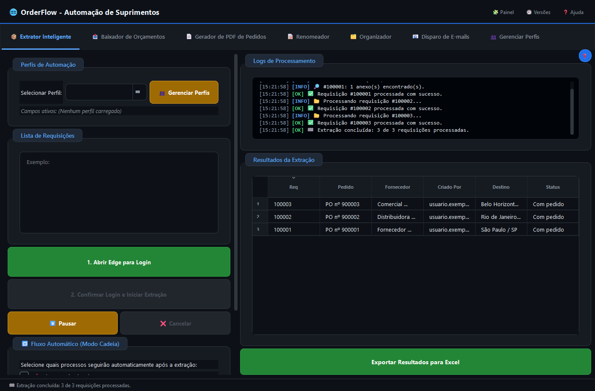
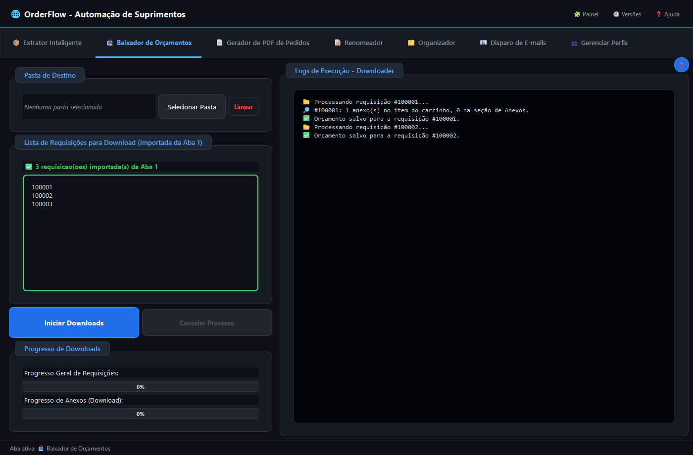
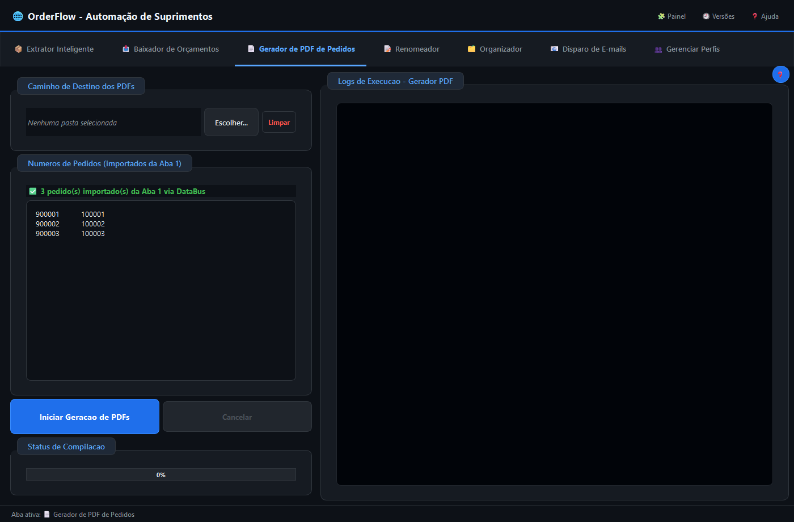
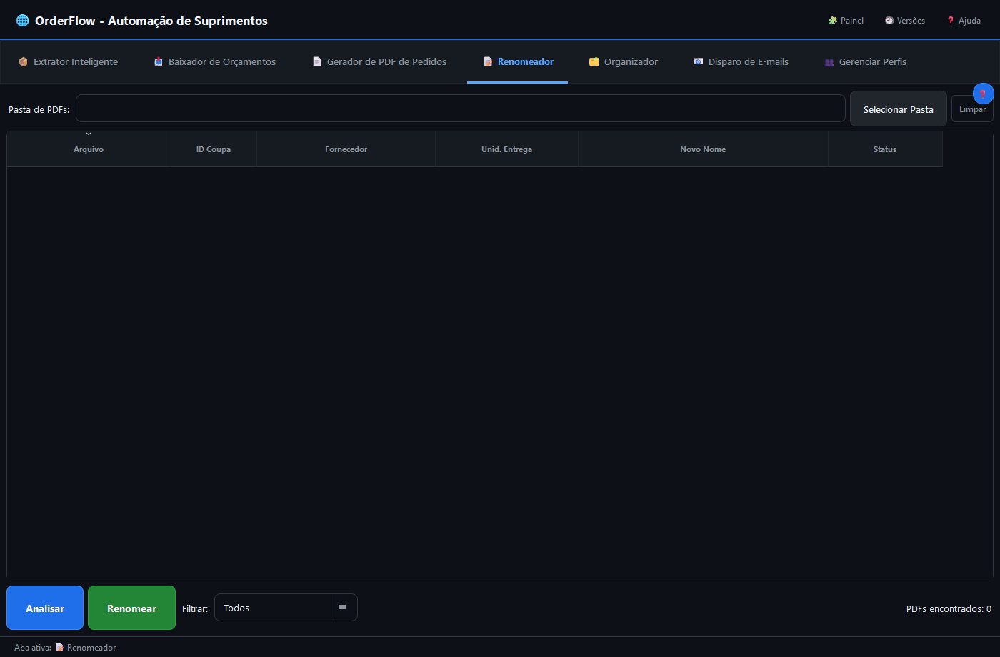
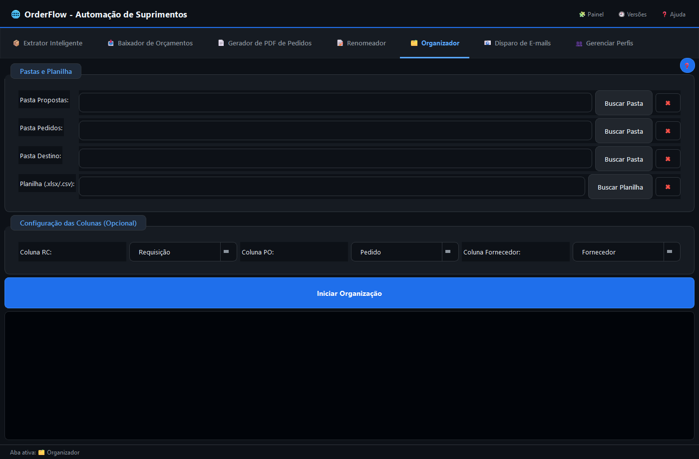
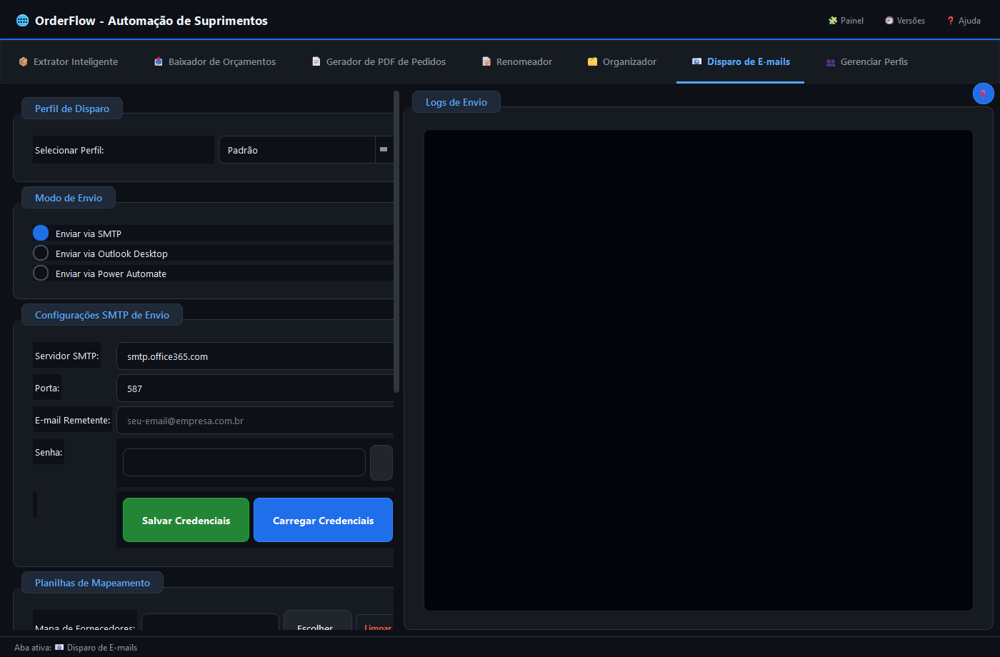
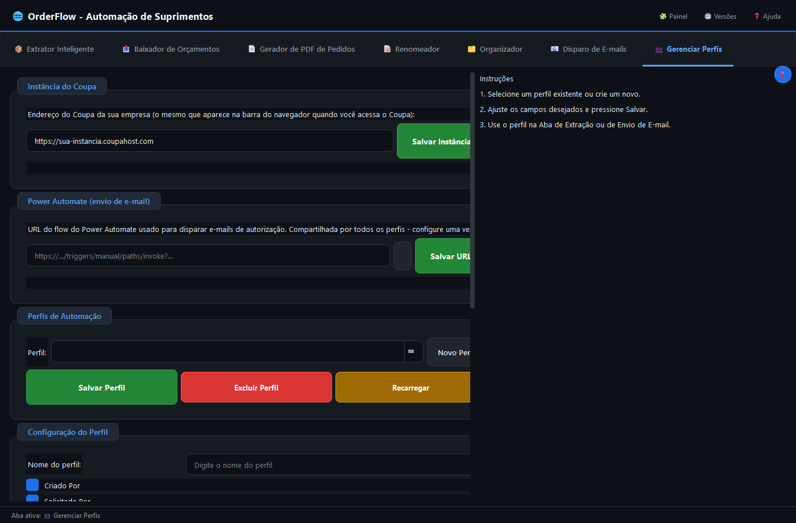
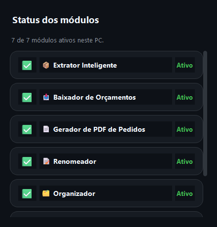

# OrderFlow

[](https://www.python.org/)
[](https://www.riverbankcomputing.com/software/pyqt/)
[](https://github.com/RafaelSilvaWork/OrderFlow/actions/workflows/ci.yml)
[](LICENSE)

OrderFlow é uma aplicação desktop em Python para automatizar fluxos operacionais relacionados a compras e supply chain na plataforma Coupa.

Este projeto não é afiliado, endossado ou patrocinado pela Coupa Software Inc. "Coupa" é usado aqui apenas de forma descritiva, para indicar a plataforma com a qual o OrderFlow interage.

## Visão geral

O projeto reúne em uma interface única as etapas de:
- extração de dados de requisições;
- download e filtragem de anexos (identificação automática de orçamentos);
- geração de PDFs de pedidos;
- renomeação de arquivos;
- organização de documentos;
- envio de e-mails de autorização.

## Capturas de tela

*Interface com dados de demonstração (fictícios) - nenhuma requisição, fornecedor ou pedido real é mostrado.*

| Extrator Inteligente | Baixador de Orçamentos |
|---|---|
|  |  |

| Gerador de PDF de Pedidos | Renomeador |
|---|---|
|  |  |

| Organizador | Disparo de E-mails |
|---|---|
|  |  |

| Gerenciar Perfis | Painel de status dos módulos |
|---|---|
|  |  |

## Requisitos

- Python 3.10+
- Microsoft Edge instalado
- Windows 10/11 (64-bit)

## Instalação

```bash
git clone https://github.com/RafaelSilvaWork/OrderFlow
cd OrderFlow
python -m venv .venv
.venv\Scripts\activate
pip install -r requirements.txt
playwright install msedge
copy .env.example .env
```

Edite o arquivo .env com os valores da sua instância Coupa e execute:

```bash
python main.py
```

## Configuração

O projeto lê configurações via variáveis de ambiente ou arquivo .env. As principais opções incluem:
- COUPA_BASE_URL
- COUPA_FW_SECRET
- MAP_FORNECEDORES
- MAP_UNIDADES
- MAP_SOLICITANTES
- EDGE_EXECUTABLE_PATH

### Personalizando a marca (branding)

O projeto suporta duas variantes de marca a partir do mesmo código (ver
`modules/branding.py`), escolhida pela variável de ambiente `CFW_BRANDING`:
- `generic` (padrão neste repositório): nome "OrderFlow", ícone/splash
  genéricos em `assets/branding/generic/`.
- Qualquer outro valor: assume os assets em `assets/branding/hapvida/`, que
  **não existem neste repositório público** - esse é o mecanismo usado por um
  fork/camada privada para aplicar uma marca própria sem duplicar a lógica de
  automação. Pra criar a sua própria marca, adicione uma pasta
  `assets/branding/<sua-marca>/` (com `icon.ico` e `logo_pecas/`) e ajuste
  `modules/branding.py`.

## Estrutura do projeto

- main.py: ponto de entrada da aplicação
- modules/: widgets, serviços e utilidades
- modules/branding.py: configuração de marca (ver seção acima)
- tests/: testes automatizados
- .github/workflows/: CI/Release do repositório

## Qualidade

O repositório inclui:
- testes automatizados;
- checagem estática com Ruff e mypy;
- workflow de CI para pull requests e pushes principais.

## Status do projeto

- Estado atual: estável para uso operacional básico.
- Cobertura de testes: foco em fluxos principais de extração, renomeação e atualização.
- Manutenção: evolução contínua em arquitetura, confiabilidade e experiência do usuário.

## Licença

Distribuído sob a licença MIT - veja [LICENSE](LICENSE).
